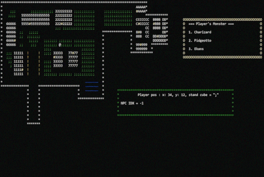

# README #

* 建置環境: x86_Debug

* 這是一個完全在終端機內完成的模擬互動式介面的小遊戲。

## 以下是開發文件規格

### 玩家可以使用鍵盤在地圖移動
1. '@' 代表玩家, red
2. WSAD 作為方向鍵 W(上) S(下) A(左) D(右)
3. 地圖標示
4. '\*' 牆壁,無法穿越
5. ';' 草地, green,可以穿越
6. '!' 樹木, brown,無法穿越
7. '~' 水池, blue,可以穿越
8. 1-9, A, B, C,D 建築物, 無法穿越
9. '#' 建築入口, yellow,可以穿越

### 抓寵流程
1. 玩家移動時, 有10%機率可以進入抓寵流程
2. 隨機從32隻寵物挑選一支
3. 在特殊地形時, 指定類型的寵物機率增加40%; 草地(grass), 水池(water)
4. 需要顯示待抓寵物的屬性
5. 需要顯示玩家目前擁有的寵物
6. 玩家可以選擇開始抓寵或放棄
7. 開始抓寵後, 有50%機率可以抓到
8. 抓到寵物後，若已擁有寵物數量已滿(最多3隻)，可
9. 以選擇放棄指定的寵物

### 進入建築入口, 會觸發與NPC進行寵物對戰
1. 總共有13棟建築, 請設定13個NPC
2. 每個NPC擁有3隻寵物
3. 寵物對戰
4. 需顯示雙方的對戰清單
5. 需顯示當下對戰寵物的圖示, 狀態, 技能
6. 對戰採回合制, 速度高的寵物先攻, 按空白鍵進入下一回合
7. 需顯示當下的對戰訊息，例如寵物A攻擊寵物B, 寵物B損失3點血量, 寵物B中毒了

### 寵物對戰
1. 當某一方寵物都死亡時，結束對戰
2. 對戰結束後，玩家寵物完全恢復
3. 13個NPC挑戰結果, 獲勝達7場, 遊戲結束

